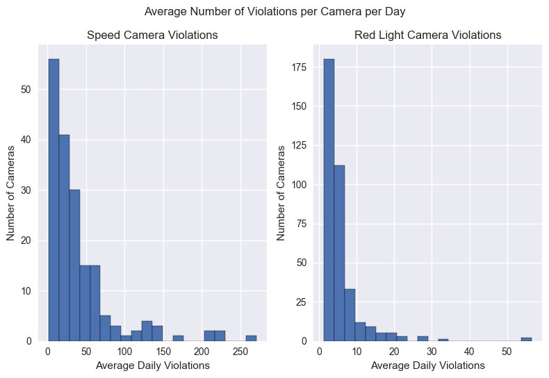
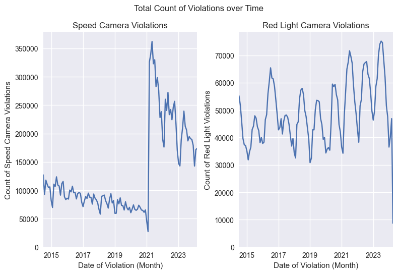
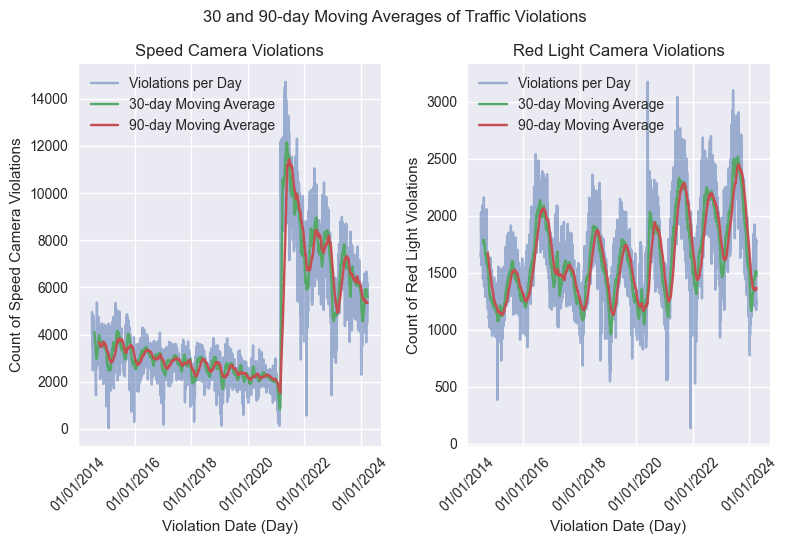
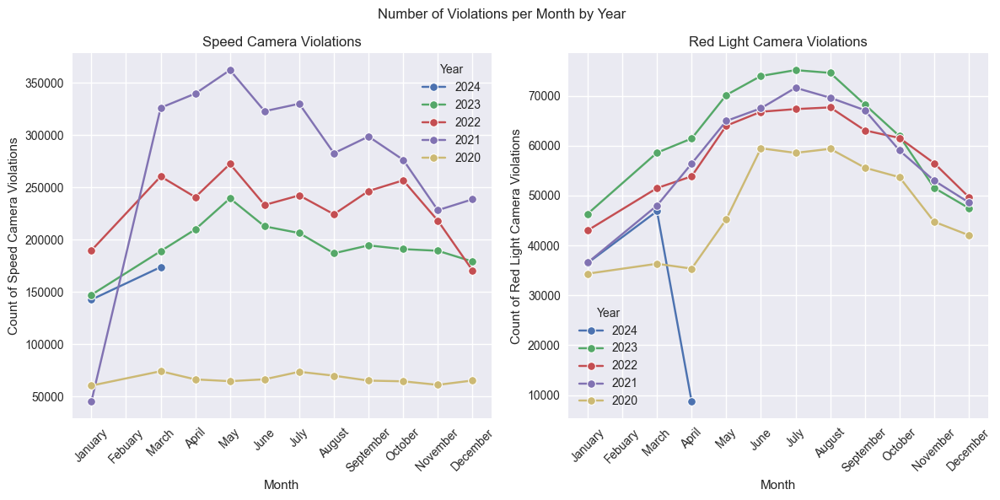
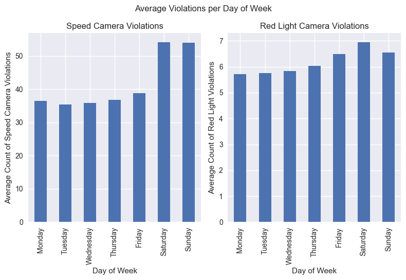
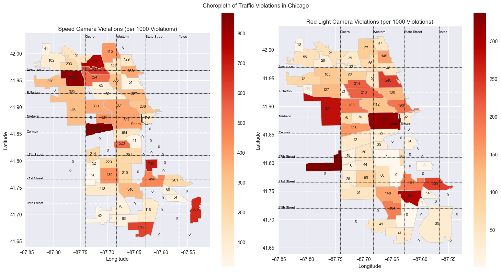

# Overview
This project analyzes the data relating to how Chicago issues tickets for red light cameras and speed cameras. The goal is to educate the public on how driving on certain days, times, and neighborhoods put them at different levels of risk for getting tickets.

# Technical setup
The required dependencies are in `requirements.txt` and were managed using pip. Install with
```
$ python -m venv env
$ source env/bin/activate
$ pip install -r requirements.txt
```

# Analysis

### Overview
I was shocked to see that a mere 181 speed cameras and 365 red light cameras were able to issue in excess of 20 million citations since 2014. On average, each camera issues about 50 tickets per day. But is the overall average a fair representation for how these cameras operate? We can create a histogram that tracks how tickets each camera issues per day on average. As one would expect, the distribution is right-skewed, indicating that the majority of cameras issue between 0-10 tickets a day. As an honorable/dishonoroable mention, I would like to call out the speed camera at **901 N CLARK ST** which issues a whopping 270 violations per *day* on average. Lincoln Park residents, beware.




### History
I obviously wanted to see how the issuing of tickets has changed over time. Consider the chart below that counts the number of speed and red light camera violations since 2014. 





Naturally, these charts elicit the question of what happened in March of 2021 that caused such an aggressive spike in the issuing of speed camera violations. The decline in violations leading up to March can be attributed to two things. First, the city's COVID lockdown. People were staying inside -> there were fewer cars on the road -> there were fewer tickets issued to said cars. As the summer of 2021 was approaching, the weather was starting to warm, COVID mandates were being lifted, and the city was coming back to life. The second, much more consequential action that prompted the cities rise in traffic tickets has to do with legislation. It was in March of 2021 that the mayor of Chicago **reduced** the minimium speed required to be cited by a speed camera. For many years, it was 10mph or more would get you the ticket. In March 2021, they added a new tier where going 6-10mph over the speed limit would get you a ticket ([source](https://abc7chicago.com/chicago-speed-camera-ticket-cameras-pay-speeding/13255936/)). It should be noted that the tickets take a few weeks to review and mail to the residents, so it's common for people to get rung up a few times by the same camera before being informed they had done so.

As far as an explanation for the oscillations in the red light camera tickets, all of those local minima are in the months of January and February. For those that may be unaware, those two months are the coldest of the year in Chicago. We've had at least a couple polar vortexes, and plenty of days below 0. On such days, most Chicagoans tend to stay indoor and make sure their water pipes don't explode; hence, the dip in red light camera violations.

### Seasonality
As we've seen above, the season makes a big difference as to how many tickets are issued. This is addressed specifically in the next chart.



As I mentioned above, the desire to stay indoors in January and February causes a slow start to the beginning of the year. The number of tickets issued is greatest in the peak social months of the year: summer. 

Note: We can also see that the highest point on the Speed Camera Violations subplot is March of 2021, which is when the speed limit threshold was reduced. It took Chicagoans a few months to figure it out, but they eventually got those numbers down.

I've implied several times in this analysis that the number of tickets issued is commensurate with how active the social scene is in Chicago. If you were doubting me, then take a look at the chart below. For speed cameras, Saturday and Sunday were 30% above the average for the rest of the week. Those numbers were down to 20% over for red light cameras, but it's still significant. This is also likely when people come to visit the city and aren't aware of how the cameras work and where they are located.


### Communitiews
As this is certainly the most elaborate chart on this analysis, let's take a moment to discuss it. 



This map represents the borders of the official 77 communities in Chicago. It's interesting how some communities have speed cameras but no red light cameras and vice versa. Apparently, driving a few miles due south of the city center (denoted with a little Sears Tower icon) is the safest place to drive without getting tickets. I was surprised to see that the top 5 communities for the red light analysis had no over lap with the top 5 communities for the speed camera analysis. However, it is clear that the North and West sides of the city have the highest frequency of citations. This is expected, seeing as it's where the majority of the population lives. 

# References
Data was queried utilizing the [Socrata API](https://dev.socrata.com/).

All data was gathered from https://data.cityofchicago.org/.

[1] [Geospatial data](https://data.cityofchicago.org/Facilities-Geographic-Boundaries/Boundaries-Community-Areas-current-/cauq-8yn6)

[2] [Red light camera violations](https://data.cityofchicago.org/Transportation/Red-Light-Camera-Violations/spqx-js37/about_data)

[3] [Speed camera violations](https://data.cityofchicago.org/Transportation/Speed-Camera-Violations/hhkd-xvj4/about_data)